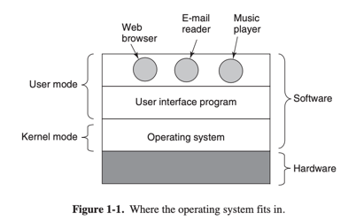
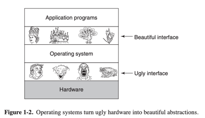

# Modern Operating Systems

Most computers have two modes of operation:

- kernel mode
- user mode

The operating system, the most fundamental piece of software, runs in kernel mode (also called supervisor mode). In this
mode it has complete access to all the hardware and can execute any instruction the machine is capable of executing.

The rest of the software runs in user mode, in which only a subset of the machine instructions is available. In
particular, those instructions that affect control of the machine or do I/O )Input/Output" are forbidden to user-mode
programs.

